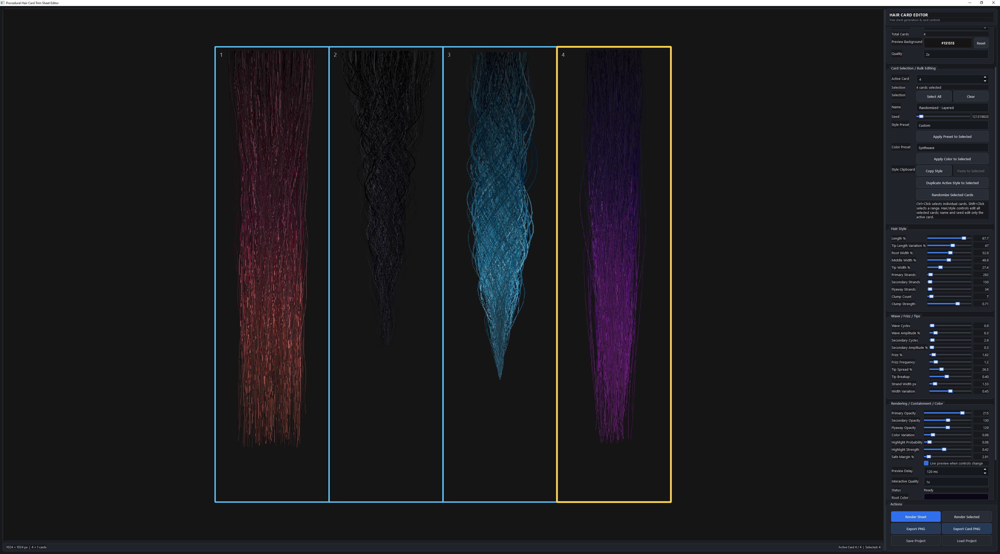

# Hair Card Generator

This project is a standalone Hair card generator for quick and easy hair card trim sheet creation.

[Latest Release](https://github.com/PurgatoryMP/Hair-Card-Generator/blob/main/release/Hair%20Card%20Generator.exe)

## Features

* **Procedural Strand Generation**: Control primary strands, secondary strands, and flyaways.
* **Deep Customization**: Adjust wave cycles, frizz, clump strength, tip spread, and width variations.
* **Color Dynamics**: Set root, mid, and tip colors with randomized variation and procedural highlights.
* **Trim Sheet Assembly**: Compile multiple unique hair cards into a single high-resolution texture sheet.
* **Interactive Interface**: View, select, and modify cards via a multithreaded PySide6 GUI.

## Source Requirements

* Python 3.11 or higher
* PySide6
* Pillow (PIL)
* Numpy

## Screenshots

